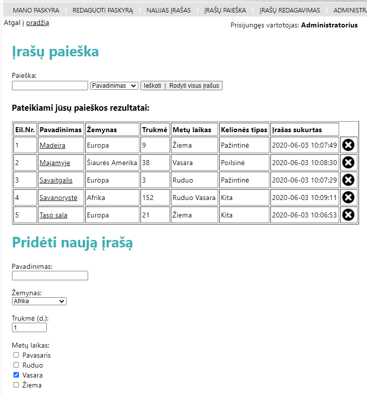

# Travels - PHP CRUD & Search

<table>
<tr>
<td>
 My first bigger PHP/MySQL learning project. It's based on Login System With Admin Features framework. Everything is commented on the code. I have examined the whole system and implemented additional operations using the same code pattern.
</td>
</tr>
</table>

## Technologies Used

* PHP 5.3.3
* MySQL 3.5

## My Features

* Create `(operacija1.php)`
* Read `(operacija2.php)`
* Update `(operacija3.php)`
* Delete `(operacija2.php)`
* Search `(operacija2.php)`

## Framework Features

  
Read More
 
  
| Feature | About |
| --- | --- |
| User Authentication | A site visitor can login, logout and register new users. Authentication is based on sessions which are stored in cookies. |
| Admin Center | Administrator has full control over registered users. Admin can view user info, upgrade/demote user levels, delete users, delete inactive users, and ban users. |
| Member Levels | Users can be differentiated by what level they are (user, manager, admin, etc.) |
| Account Info | Users can view their own information, and edit it as well. They can also see the information of other users. |
| Better Security | Passwords are not stored in cookies, randomly generated ID's take their place. |
| Visitor Tracking | You can tell how many guests and users are actively viewing your site, and who those users are. You also know how many total members your site has. |
| Form Helper | No ugly error pages. Users are redirected to the form they filled out and the errors that have occurred are displayed. |
| Email | Only if your server is properly setup to send mail. |

## Demo

Live project - [http://pocketful.byethost17.com/](http://pocketful.byethost17.com)

Login by registering your own user or use one of the following ones:

* `Administratorius`
* `Valdytojas`
* `Vartotojas`

The password is the same for all those accounts: `demo`  
Only `Administratorius` account has access to all features.

## Setup

* Be aware that this project uses older PHP and SQL versions.
* Change credentials in `include/constants.php` file (look for *Database Constants*, on top of the file)
* All the tables needed are written in the file `db.sql`. You can look at the file and create each table manually or you can just run the file with MySQL and it will create all the necessary tables automatically.

## Testing
* Selenium

## Sources
This website is based on ["PHP Login System With Admin Features"](https://evolt.org/PHP-Login-System-with-Admin-Features) framework.

 

[:arrow_up_small: **Back To Top**](#top)